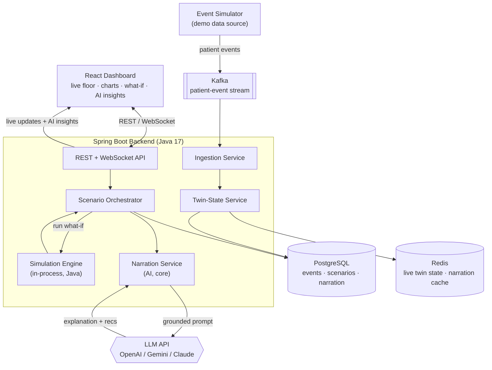

# FlowTwin

**A real-time digital twin for emergency-department patient flow — spot bottlenecks before they form, test fixes before you commit to them, and get an AI to explain what to do about it.**


---

## Overview

Emergency departments and busy OPDs run on invisible queues. When triage backs up, beds fill, or a shift is understaffed at the wrong hour, patients wait longer — and in the ED, longer boarding time is linked to worse outcomes. The problem is that administrators are flying blind: they see *today's* mess after it has already happened, and they have no safe way to ask *"what if we added one nurse at 6 PM?"* without gambling with real patients.

**FlowTwin** builds a live, virtual replica (a *digital twin*) of the department floor. It ingests patient-flow events in real time, continuously simulates the near future, and lets staff run **what-if scenarios** — changing staffing, bed capacity, or triage rules — and immediately see the projected impact on wait times and bottlenecks. A built-in **AI narration layer** then turns the raw simulation output into a plain-language explanation and a ranked set of recommendations, so a charge nurse gets an answer, not a spreadsheet.

> This is a hackathon prototype. It runs on a built-in event simulator so the full experience works end-to-end with zero external dependencies. The architecture is designed so real hospital feeds (e.g. FHIR/ABDM event streams) can replace the simulator later.

---

## What FlowTwin Does

- **Live floor view** — a real-time picture of every patient, resource, and queue in the department, pushed to the browser over WebSockets.
- **Forward simulation** — continuously projects the next N hours of patient flow, surfacing bottlenecks *before* they happen.
- **What-if scenarios** — change staffing, bed count, or triage policy and recompute projected wait times on demand, without touching the live twin.
- **Wait-time prediction** — estimated time-to-triage, time-to-bed, and length-of-stay per patient and per zone.
- **AI narration & recommendations** — a core LLM layer explains *why* a scenario helps and what to do next: *"Adding one nurse to triage from 6–9 PM reduces projected wait by ~22% and clears the triage backlog by 7:15 PM. Next best lever: open 2 fast-track beds."*
- **Replayable history** — every event and scenario is persisted, so you can rewind and audit how the day unfolded.

---

## How It Works



**Data flow, in words:**

1. The **event simulator** emits realistic patient-flow events (`PATIENT_ARRIVED`, `TRIAGED`, `BED_ASSIGNED`, `DISCHARGED`, …) onto a **Kafka** topic. In production this is where a real hospital feed plugs in.
2. The **Ingestion Service** consumes the stream and updates the **Twin-State Service**, the authoritative model of "what the department looks like right now."
3. Current state lives in **Redis** for fast reads; every event is also persisted to **PostgreSQL** for history and replay.
4. When a user runs a scenario, the **Scenario Orchestrator** snapshots the current twin and hands it to the **Simulation Engine** (an in-process Java module), which runs a discrete-event simulation forward under the requested conditions.
5. The structured result (before/after metrics, bottleneck timeline) is passed to the **Narration Service**, which builds a grounded prompt and calls the **LLM** to produce a plain-language explanation plus ranked recommendations.
6. The scenario result and its narration are stored, cached, and pushed to the dashboard over **WebSockets**.

---

## Tech Stack

| Layer | Technology |
|---|---|
| Backend | Java 17, Spring Boot 4.0 (Spring Framework 7 — Web, WebSocket, Data JPA, Kafka) |
| Simulation | In-process discrete-event simulation engine (custom Java, no external runtime) |
| AI narration | LLM via OpenAI / Gemini / Claude API (pluggable provider), grounded on simulation output |
| Datastore | PostgreSQL (events, scenarios, narration) |
| Cache / live state | Redis (live twin state + narration cache) |
| Messaging | Apache Kafka |
| Realtime | WebSocket (STOMP) |
| Frontend | React + a charting library (Recharts / Chart.js) |
| Infra | Docker + Docker Compose |

> **Design note:** the entire backend is a single Java service. The simulation runs **in-process** — no Python, no separate microservice. Everything that carries the engineering weight (event ingestion, twin-state management, scenario orchestration, the simulation engine, AI narration orchestration, realtime delivery, persistence) is built here.

---

## Project Structure

```
flowtwin/
├── backend/                     # Spring Boot application (Java 17, Spring Boot 4.0)
│   ├── src/main/java/com/flowtwin/
│   │   ├── api/                 # REST controllers + WebSocket endpoints
│   │   ├── ingestion/           # Kafka consumers, event handlers
│   │   ├── twin/                # Twin-state service (Redis + JPA)
│   │   ├── scenario/            # Scenario orchestrator
│   │   ├── simulation/          # Discrete-event simulation engine (in-process)
│   │   ├── narration/           # LLM narration service (prompt build, provider client, cache)
│   │   ├── model/               # Domain entities (Patient, Resource, Event…)
│   │   └── config/              # Kafka, Redis, WebSocket, LLM, security config
│   └── src/main/resources/
├── simulator/                   # Event generator (seeds the demo)
├── frontend/                    # React dashboard
├── docker-compose.yml           # Postgres, Redis, Kafka, backend, frontend
└── README.md
```

---

## Getting Started

### Prerequisites

- Docker & Docker Compose
- JDK 17 and Maven *(only if running the backend outside Docker)*
- Node 18+ *(only if running the frontend outside Docker)*
- **An LLM API key** — required for the AI narration layer (OpenAI, Gemini, or Claude)

### Quickstart

```bash
# 1. Clone
git clone https://github.com/<your-team>/flowtwin.git
cd flowtwin

# 2. Configure environment
cp .env.example .env
# set LLM_PROVIDER and LLM_API_KEY in .env  (required for narration)

# 3. Bring up the whole stack (Postgres, Redis, Kafka, backend, frontend)
docker compose up --build

# 4. Open the dashboard
#    http://localhost:3000
```

The event simulator starts automatically and begins feeding the twin, so the dashboard comes alive within a few seconds.

### Running services individually (dev mode)

```bash
# Backend (Java 17)
cd backend && ./mvnw spring-boot:run

# Frontend
cd frontend && npm install && npm run dev
```

### Key environment variables

| Variable | Purpose | Default |
|---|---|---|
| `POSTGRES_URL` | Postgres connection string | `jdbc:postgresql://postgres:5432/flowtwin` |
| `REDIS_HOST` | Redis host | `redis` |
| `KAFKA_BOOTSTRAP` | Kafka bootstrap servers | `kafka:9092` |
| `LLM_PROVIDER` | Narration provider (`openai` \| `gemini` \| `claude`) | `openai` |
| `LLM_API_KEY` | **Required** — key for the chosen provider | *(none — must be set)* |
| `LLM_MODEL` | Model name for the chosen provider | provider default |

---

## Key API Endpoints

| Method | Endpoint | Description |
|---|---|---|
| `GET` | `/api/twin/state` | Current snapshot of the department twin |
| `GET` | `/api/twin/metrics` | Live wait-time and occupancy metrics |
| `POST` | `/api/scenarios` | Run a what-if scenario, returns projected impact + AI narration |
| `GET` | `/api/scenarios/{id}` | Fetch a stored scenario result + narration |
| `GET` | `/api/history?from=&to=` | Replay events over a time window |
| `WS` | `/ws/twin` | WebSocket stream of live twin updates + AI insights |

**Example — run a what-if scenario:**

```bash
curl -X POST http://localhost:8080/api/scenarios \
  -H "Content-Type: application/json" \
  -d '{
        "name": "Extra triage nurse 18:00-21:00",
        "changes": [
          { "type": "STAFF", "role": "NURSE", "zone": "TRIAGE",
            "delta": 1, "from": "18:00", "to": "21:00" }
        ],
        "horizonHours": 4
      }'
```

Returns projected wait times, a bottleneck timeline, and an AI-generated explanation + ranked recommendations.

---

## The Simulation Engine

FlowTwin models the department as a **discrete-event queueing network**, implemented as an in-process Java module:

- **Entities** — patients, each with an acuity level and a care pathway.
- **Resources** — triage stations, beds, nurses, doctors, each with capacity and shift schedules.
- **Events** — arrivals (driven by a forecast arrival-rate), triage, treatment, admission/discharge, processed in timestamp order from a priority queue.
- **What-if** — a scenario overlays changes (staffing, capacity, triage policy) onto a snapshot of the live twin, then runs the simulation forward independently of the real twin. Multiple scenarios can run in parallel via an executor.

For the hackathon, arrival rates and service times come from configurable distributions seeded by the event simulator. The engine is interface-driven so a trained forecasting model (surge prediction) can later feed the arrival process without touching the orchestration layer.

---

## The AI Narration Layer

Simulation output is a pile of numbers. The narration layer is what makes FlowTwin usable by a human under pressure — it is a **core part of the product, not a bolt-on**.

**How it stays trustworthy (grounded, not hallucinated):** the LLM never sees raw patient data and is never asked to *invent* numbers. The Narration Service builds a compact, structured prompt from the simulation's own output — baseline metrics, post-scenario metrics, the deltas, and the bottleneck timeline — and asks the model only to **explain and prioritise** those facts. Every figure in the narration traces back to a number the simulation produced.

**Input → output:**

- **Input:** a structured `ScenarioResult` (before/after wait times per zone, resource utilisation, projected bottleneck windows, the changes applied).
- **Output:** a short natural-language summary, a *why*, and a ranked list of next-best recommendations — returned as structured JSON so the dashboard can render it cleanly.

**Engineering details:**

- **Pluggable provider** — a `NarrationProvider` interface with OpenAI / Gemini / Claude implementations, selected via `LLM_PROVIDER`.
- **Caching** — narrations are keyed by a hash of the scenario result and cached in Redis, so identical scenarios don't re-hit the API (and the live demo stays fast).
- **Resilience** — if the provider is unreachable mid-demo, the service falls back to a deterministic templated summary built from the same numbers, so the UI never shows a blank card. The AI is the intended path; the template is only a safety net.

---

## Demo Script (≈3 minutes)

1. **Open the dashboard** — patients flow in live; the floor view and wait-time chart update in real time.
2. **Trigger a surge** — the simulator ramps arrivals; watch triage back up and projected wait times climb into the red.
3. **Ask "what if?"** — drag the *"+1 triage nurse, 6–9 PM"* slider and run the scenario.
4. **See the impact + the AI answer** — the projected wait curve drops and FlowTwin narrates: *"This clears the triage backlog ~40 min sooner and cuts peak wait by ~22%. Next best lever: open 2 fast-track beds."*
5. **The pitch** — "Same engine, real hospital feed instead of our simulator, and this becomes a live, explainable decision-support tool for ED charge nurses."

---

## Roadmap

**MVP (target: hackathon)**
- [ ] Event ingestion via Kafka
- [ ] Live twin-state service (Redis + Postgres)
- [ ] In-process discrete-event simulation + one what-if lever
- [ ] Realtime dashboard over WebSockets
- [ ] AI narration layer (grounded LLM explanation + recommendations)

**Stretch**
- [ ] Trained surge-forecasting model feeding arrival rates
- [ ] Conversational follow-ups ("why is triage the bottleneck?") over the scenario context
- [ ] Multi-department twin (ED → wards → ICU)
- [ ] Real event feed via FHIR / ABDM
- [ ] Multi-scenario comparison view
- [ ] Alerting when projected wait breaches a threshold

---

## Team

- TODO — Name, role
- TODO — Name, role
- TODO — Name, role

Built at **TODO — hackathon name**, September 2026.

---

## Acknowledgments

- Conceptually inspired by digital-twin approaches to ED patient flow, including MIT Hacking Medicine's *HospiTwin* project and academic patient-pathway digital-twin frameworks.
- If you reuse simulation logic from any third-party repository (e.g. an MIT-licensed reference implementation), keep its original `LICENSE`/copyright notice and credit it here.

---

## License

Released under the MIT License. See [`LICENSE`](LICENSE).
